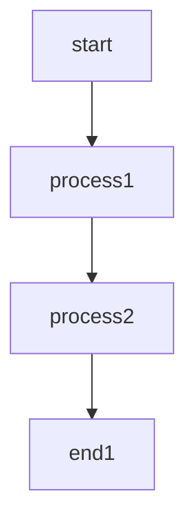
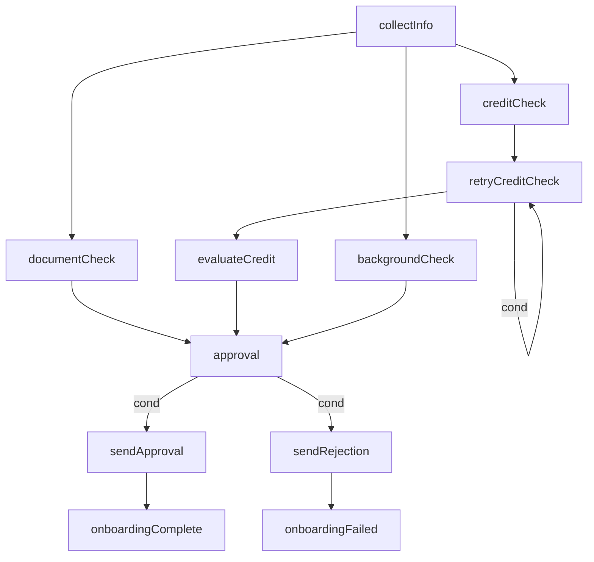
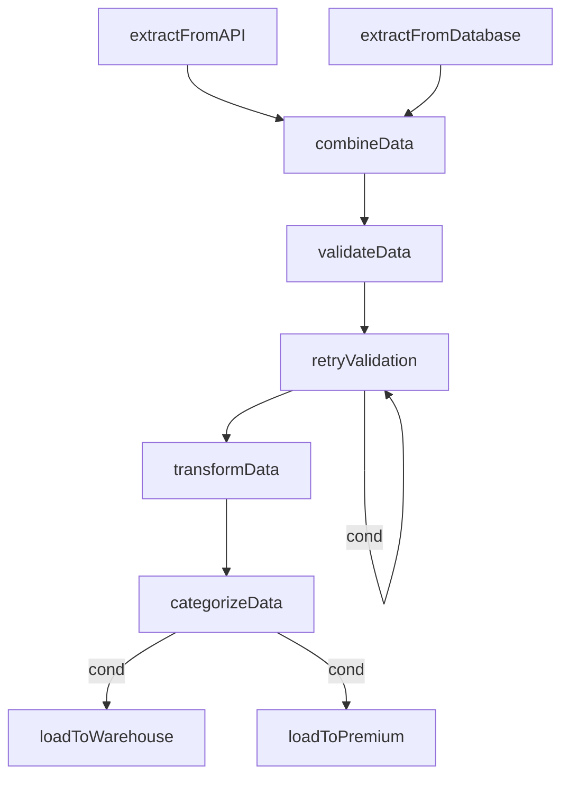
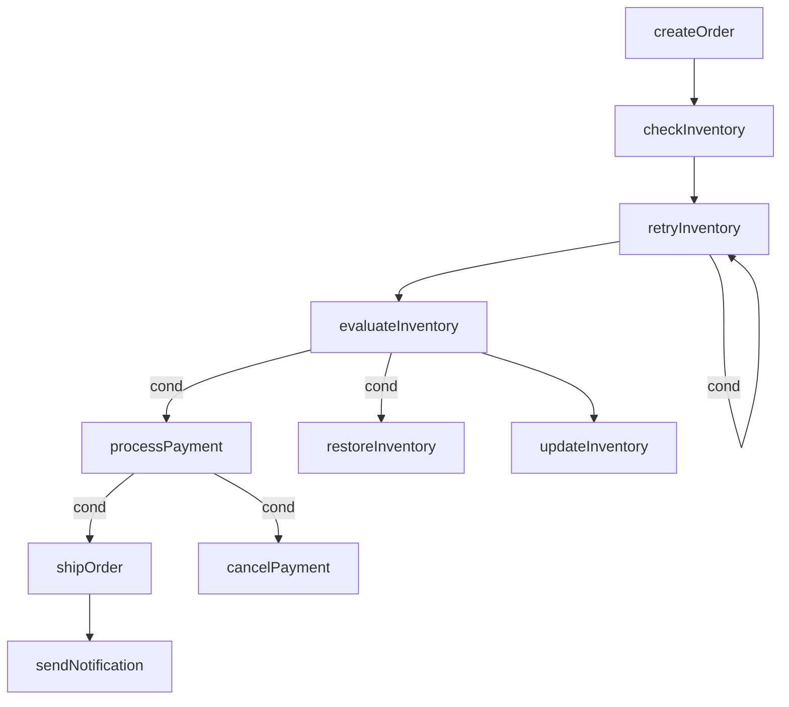

# Flow - 工作流编排库

🌍 **语言切换**: [English Documentation](README.md)

Flow 是一个强大的 Go 语言工作流构建和执行库，提供两种执行模式：线性执行链（Chain）和图形执行器（Graph）。

## 功能特性

- **线性工作流（Chain）**: 按顺序执行任务，自动传递参数
- **图形工作流（Graph）**: 使用节点和边构建复杂工作流，支持多种节点类型
- **多种节点类型**: 支持开始、结束、分支、并行和循环节点
- **条件执行**: 为边添加条件以控制工作流路径
- **并行执行**: 并发执行独立节点以提高性能
- **自动参数处理**: 任务间智能参数传递和类型转换
- **错误处理**: 全面的错误传播和处理机制
- **可视化支持**: 生成 Mermaid 和 Graphviz 图表用于工作流可视化

## 安装

```bash
go get github.com/zkep/flow
```

## 快速开始

### 基础 Chain 示例

```go
package main

import (
    "fmt"
    "github.com/zkep/flow"
)

func main() {
    chain := flow.NewChain()

    chain.Add("step1", func() int {
        return 10
    })

    chain.Add("step2", func(x int) int {
        return x * 2
    })

    chain.Add("step3", func(y int) int {
        return y + 5
    })

    err := chain.Run()
    if err != nil {
        fmt.Printf("错误: %v\n", err)
        return
    }

    result, err := chain.Value("step3")
    if err != nil {
        fmt.Printf("错误: %v\n", err)
        return
    }

    fmt.Printf("最终结果: %v\n", result) // 输出: 25
}
```

### 使用 `Use` 复用已有步骤

`Use` 方法允许您通过从现有链中选择特定步骤来创建新链。这在您想要重用已执行链中的某些步骤或创建步骤子集进行进一步处理时特别有用。

#### 示例：创建步骤子集

```go
package main

import (
    "fmt"
    "github.com/zkep/flow"
)

func main() {
    // 创建并运行完整链
    originalChain := flow.NewChain()

    originalChain.Add("loadData", func() []int {
        return []int{1, 2, 3, 4, 5}
    })

    originalChain.Add("filterData", func(data []int) []int {
        var filtered []int
        for _, num := range data {
            if num > 2 {
                filtered = append(filtered, num)
            }
        }
        return filtered
    })

    originalChain.Add("processData", func(data []int) []int {
        var processed []int
        for _, num := range data {
            processed = append(processed, num*2)
        }
        return processed
    })

    originalChain.Add("saveData", func(data []int) error {
        fmt.Printf("保存数据: %v\n", data)
        return nil
    })

    fmt.Println("运行原始链:")
    err := originalChain.Run()
    if err != nil {
        fmt.Printf("错误: %v\n", err)
        return
    }

    // 仅使用特定步骤创建新链
    // 这允许我们重用数据加载和处理步骤
    fmt.Println("\n运行子集链:")
    subsetChain := originalChain.Use("loadData", "processData")

    err = subsetChain.Run()
    if err != nil {
        fmt.Printf("错误: %v\n", err)
        return
    }

    // 从子集链获取结果
    result, err := subsetChain.Value("processData")
    if err != nil {
        fmt.Printf("错误: %v\n", err)
        return
    }

    fmt.Printf("子集链结果: %v\n", result) // 输出: [2 4 6 8 10]
}
```

#### `Use` 方法的主要使用场景

1. **复用步骤**: 从复杂链中提取特定步骤以在不同上下文中重用
2. **部分处理**: 创建仅执行步骤子集的链以进行聚焦处理
3. **步骤隔离**: 独立测试单个步骤或步骤组
4. **动态工作流构建**: 通过从现有链中选择步骤即时构建新工作流
5. **性能优化**: 通过创建目标链避免重新执行不必要的步骤

`Use` 方法保持原始步骤名称及其顺序，确保在创建步骤子集时行为一致。

### 基础 Graph 示例

```go
package main

import (
    "fmt"
    "github.com/zkep/flow"
)

func main() {
    g := flow.NewGraph()

    g.AddNode("start", func() int {
        fmt.Println("执行开始节点")
        return 10
    })

    g.AddNode("process1", func(x int) int {
        fmt.Printf("执行 process1: %d * 2 = %d\n", x, x*2)
        return x * 2
    })

    g.AddNode("process2", func(x int) int {
        fmt.Printf("执行 process2: %d + 5 = %d\n", x, x+5)
        return x + 5
    })

    g.AddNode("end1", func(x int) {
        fmt.Printf("执行结束节点: 最终结果为 %d\n", x)
    })

    g.AddEdge("start", "process1")
    g.AddEdge("process1", "process2")
    g.AddEdge("process2", "end1")

    err := g.Run()
    if err != nil {
        fmt.Printf("错误: %v\n", err)
    } else {
        fmt.Println("执行成功完成")
    }
}
```

### 图形可视化



## 使用说明

### Chain

Chain 模式允许您创建线性工作流，其中每个步骤按顺序执行，一个步骤的输出自动作为输入传递给下一步。

#### 创建 Chain

```go
chain := flow.NewChain()
```

#### 添加步骤

```go
chain.Add("stepName", func() int {
    return 42
})
```

#### 运行 Chain

```go
err := chain.Run()
if err != nil {
    // 处理错误
}
```

#### 检索结果

```go
// 从步骤获取单个值
result, err := chain.Value("stepName")

// 从步骤获取所有值
results, err := chain.Values("stepName")
```

### Graph

Graph 模式允许您使用节点和边创建复杂的工作流，支持不同的节点类型和执行策略。

#### 创建 Graph

```go
graph := flow.NewGraph()
```

#### 添加节点

```go
// 添加节点
graph.AddNode("process", func(x int) int {
    return x * 2
})

// 多输入节点
graph.AddNode("combine", func(a, b int) int {
    return a + b
})

// 带错误返回的节点
graph.AddNode("validate", func(x int) (int, error) {
    if x < 0 {
        return 0, fmt.Errorf("无效值")
    }
    return x, nil
})
```

#### 添加边

```go
// 简单边
graph.AddEdge("fromNode", "toNode")

// 带条件的边
graph.AddEdgeWithCondition("fromNode", "toNode", func(x int) bool {
    return x > 0
})

// 循环边（用于重试/循环场景）
graph.AddLoopEdge("retryNode", func(result int) bool {
    return result < 100
}, 3) // 最大 3 次迭代

// 分支边（多个条件路径）
graph.AddBranchEdge("decisionNode", map[string]any{
    "pathA": func(result int) bool { return result > 50 },
    "pathB": func(result int) bool { return result <= 50 },
})
```

#### 运行 Graph

```go
// 运行图形
err := graph.Run()

// 带上下文运行
ctx := context.Background()
err := graph.RunWithContext(ctx)
```

#### 检索节点信息

```go
// 获取节点状态
status := graph.NodeStatus("nodeName")

// 获取节点结果
result := graph.NodeResult("nodeName")

// 获取节点错误
err := graph.NodeError("nodeName")
```

#### 可视化

```go
// 生成 Mermaid 图表
mermaid := graph.Mermaid()
fmt.Println(mermaid)

// 生成 Graphviz 图表
graphviz := graph.String()
fmt.Println(graphviz)
```

## 边类型

| 边类型 | 描述 |
|--------|------|
| Normal | 连接两个节点的标准边 |
| Loop | 用于循环/重试操作的边（源和目标节点相同） |
| Branch | 带条件分支到多个目标节点的边 |

## 执行策略

- **顺序执行**: 节点按拓扑顺序一个接一个执行
- **并行执行**: 独立节点并发执行以提高性能

## 高级特性

### 条件执行

使用 `AddEdgeWithCondition` 为边添加条件，允许基于运行时值的动态工作流路径。

### 并行执行

图形执行器在可能时自动处理独立节点的并行执行，这可以显著提高具有许多独立任务的工作流性能。

### 错误处理

Flow 自动通过工作流传播错误，在发生错误时停止执行。

### 参数处理

Flow 自动处理节点间的参数传递，包括可能的类型转换。

## 实际应用场景

### 1. 数据处理管道

**场景**: 处理具有多个转换步骤的大型数据集

**实现**:
- 使用 `Chain` 进行顺序数据处理步骤
- 每个步骤转换数据并传递给下一步
- 在每个步骤添加错误处理以捕获数据异常

**示例**:
```go
chain := flow.NewChain()

chain.Add("loadData", func() []string {
    // 从文件/数据库加载数据
    return []string{"data1", "data2", "data3"}
})

chain.Add("cleanData", func(data []string) []string {
    // 清理和验证数据
    var cleaned []string
    for _, item := range data {
        if item != "" {
            cleaned = append(cleaned, strings.TrimSpace(item))
        }
    }
    return cleaned
})

chain.Add("transformData", func(data []string) []map[string]string {
    // 将数据转换为结构化格式
    var transformed []map[string]string
    for _, item := range data {
        transformed = append(transformed, map[string]string{"value": item})
    }
    return transformed
})

chain.Add("saveData", func(data []map[string]string) error {
    // 保存数据到数据库
    for _, item := range data {
        // 保存项目到数据库
        fmt.Printf("保存: %v\n", item)
    }
    return nil
})

if err := chain.Run(); err != nil {
    fmt.Printf("管道失败: %v\n", err)
}
```

### 2. 业务流程自动化

**场景**: 自动化客户入职流程，包括信用检查、背景验证和审批工作流

**实现**:
- 使用 `Graph` 建模复杂的审批工作流
- 使用 `AddLoopEdge` 进行信用检查重试
- 使用 `AddBranchEdge` 进行条件批准/拒绝路径
- 使用并行执行进行独立验证步骤

**示例**:
```go
graph := flow.NewGraph()

// 收集客户信息
graph.AddNode("collectInfo", func() map[string]string {
    return map[string]string{
        "name":  "John Doe",
        "email": "john@example.com",
        "score": "85",
    }
})

// 信用检查
graph.AddNode("creditCheck", func(info map[string]string) (int, error) {
    score, _ := strconv.Atoi(info["score"])
    fmt.Printf("信用检查: 分数 = %d\n", score)
    return score, nil
})

// 重试信用检查（循环节点）
graph.AddNode("retryCreditCheck", func(score int) int {
    fmt.Printf("重试信用检查，当前分数: %d\n", score)
    return score + 5
})
// 添加带条件和最大迭代次数的循环边
graph.AddLoopEdge("retryCreditCheck", func(score int) bool {
    return score < 70
}, 3)

// 评估信用分数
graph.AddNode("evaluateCredit", func(score int) bool {
    return score >= 70
})

// 背景验证
graph.AddNode("backgroundCheck", func(info map[string]string) bool {
    time.Sleep(100 * time.Millisecond)
    return true
})

// 文档验证
graph.AddNode("documentCheck", func(info map[string]string) bool {
    time.Sleep(150 * time.Millisecond)
    return true
})

// 审批决策
graph.AddNode("approval", func(creditOk, backgroundOk, documentOk bool) string {
    if creditOk && backgroundOk && documentOk {
        return "approve"
    }
    return "reject"
})

// 发送批准通知
graph.AddNode("sendApproval", func(decision string) {
    fmt.Printf("批准客户（决策: %s）\n", decision)
})

// 发送拒绝通知
graph.AddNode("sendRejection", func(decision string) {
    fmt.Printf("拒绝客户（决策: %s）\n", decision)
})

// 入职完成
graph.AddNode("onboardingComplete", func() {
    fmt.Println("客户入职成功完成")
})

// 入职失败
graph.AddNode("onboardingFailed", func() {
    fmt.Println("客户入职失败")
})

// 添加边
graph.AddEdge("collectInfo", "creditCheck")
graph.AddEdge("collectInfo", "backgroundCheck")
graph.AddEdge("collectInfo", "documentCheck")
graph.AddEdge("creditCheck", "retryCreditCheck")
graph.AddEdge("retryCreditCheck", "evaluateCredit")
graph.AddEdge("evaluateCredit", "approval")
graph.AddEdge("backgroundCheck", "approval")
graph.AddEdge("documentCheck", "approval")
// 批准/拒绝的分支边
graph.AddBranchEdge("approval", map[string]any{
    "sendApproval":  func(decision string) bool { return decision == "approve" },
    "sendRejection": func(decision string) bool { return decision == "reject" },
})
graph.AddEdge("sendApproval", "onboardingComplete")
graph.AddEdge("sendRejection", "onboardingFailed")

// 运行图形
if err := graph.Run(); err != nil {
    fmt.Printf("入职流程失败: %v\n", err)
}
```

### 客户入职可视化



### 3. ETL（提取、转换、加载）工作流

**场景**: 从多个来源提取数据，验证、转换并根据数据值加载到适当的存储

**实现**:
- 使用 `Graph` 并行从多个来源提取数据
- 使用 `AddLoopEdge` 进行数据验证重试
- 使用 `AddBranchEdge` 基于数据值进行条件加载
- 添加数据质量问题的错误处理

**示例**:
```go
graph := flow.NewGraph()

// 从 API 提取数据
graph.AddNode("extractFromAPI", func() []map[string]interface{} {
    return []map[string]interface{}{
        {"id": 1, "name": "Product A", "price": 100},
        {"id": 2, "name": "Product B", "price": 200},
    }
})

// 从数据库提取数据
graph.AddNode("extractFromDatabase", func() []map[string]interface{} {
    return []map[string]interface{}{
        {"id": 3, "name": "Product C", "price": 150},
        {"id": 4, "name": "Product D", "price": 250},
    }
})

// 合并提取的数据
graph.AddNode("combineData", func(apiData, dbData []map[string]interface{}) []map[string]interface{} {
    return append(apiData, dbData...)
})

// 验证数据
graph.AddNode("validateData", func(data []map[string]interface{}) (int, []map[string]interface{}) {
    invalidCount := 0
    var validData []map[string]interface{}
    for _, item := range data {
        price := item["price"].(int)
        if price > 0 {
            validData = append(validData, item)
        } else {
            invalidCount++
        }
    }
    fmt.Printf("验证数据: %d 有效, %d 无效\n", len(validData), invalidCount)
    return invalidCount, validData
})

// 重试验证（循环节点）
graph.AddNode("retryValidation", func(countInvalid int, data []map[string]interface{}) (int, []map[string]interface{}) {
    fmt.Println("重试验证...")
    return countInvalid - 1, data
})
graph.AddLoopEdge("retryValidation", func(countInvalid int, data []map[string]interface{}) bool {
    return countInvalid > 0
}, 2)

// 转换数据
graph.AddNode("transformData", func(data []map[string]interface{}) []map[string]interface{} {
    var transformed []map[string]interface{}
    for _, item := range data {
        price := item["price"].(int)
        item["priceWithTax"] = float64(price) * 1.2
        item["category"] = "General"
        transformed = append(transformed, item)
    }
    return transformed
})

// 按价值分类数据
graph.AddNode("categorizeData", func(data []map[string]interface{}) string {
    totalValue := 0
    for _, item := range data {
        totalValue += item["price"].(int)
    }
    if totalValue > 500 {
        return "high_value"
    }
    return "normal_value"
})

// 加载到仓库
graph.AddNode("loadToWarehouse", func(data []map[string]interface{}) error {
    fmt.Printf("加载 %d 项到数据仓库\n", len(data))
    return nil
})

// 加载到高级存储
graph.AddNode("loadToPremium", func(data []map[string]interface{}) error {
    fmt.Printf("加载 %d 高价值项到高级存储\n", len(data))
    return nil
})

// 添加边
graph.AddEdge("extractFromAPI", "combineData")
graph.AddEdge("extractFromDatabase", "combineData")
graph.AddEdge("combineData", "validateData")
graph.AddEdge("validateData", "retryValidation")
graph.AddEdge("retryValidation", "transformData")
graph.AddEdge("transformData", "categorizeData")
graph.AddBranchEdge("categorizeData", map[string]any{
    "loadToWarehouse": func(category string) bool { return category == "normal_value" },
    "loadToPremium":   func(category string) bool { return category == "high_value" },
})

if err := graph.Run(); err != nil {
    fmt.Printf("ETL 流程失败: %v\n", err)
}
```

### ETL 工作流可视化



### 4. 订单处理

**场景**: 处理客户订单，包括库存检查、支付处理和发货

**实现**:
- 使用 `Graph` 建模订单处理工作流
- 使用 `AddLoopEdge` 进行库存检查重试
- 使用 `AddBranchEdge` 进行条件支付/发货路径
- 添加补偿节点用于失败处理

**示例**:
```go
graph := flow.NewGraph()

// 创建订单
graph.AddNode("createOrder", func() map[string]interface{} {
    return map[string]interface{}{
        "orderId":    "ORD-123",
        "customerId": "CUST-456",
        "items":      []string{"ITEM-1", "ITEM-2"},
        "total":      300,
    }
})

// 检查库存
graph.AddNode("checkInventory", func(order map[string]interface{}) (int, map[string]interface{}) {
    fmt.Println("检查库存...")
    return 0, order
})

// 重试库存检查（循环节点）
graph.AddNode("retryInventory", func(retryCount int, order map[string]interface{}) (int, map[string]interface{}) {
    fmt.Printf("重试库存检查（第 %d 次）...\n", retryCount+1)
    return retryCount + 1, order
})
graph.AddLoopEdge("retryInventory", func(retryCount int, order map[string]interface{}) bool {
    return retryCount < 2
}, 3)

// 评估库存可用性
graph.AddNode("evaluateInventory", func(retryCount int, order map[string]interface{}) bool {
    fmt.Println("重试后库存可用")
    return true
})

// 处理支付
graph.AddNode("processPayment", func(available bool) bool {
    fmt.Println("处理支付...")
    return true
})

// 更新库存
graph.AddNode("updateInventory", func(available bool) bool {
    fmt.Println("更新库存...")
    return true
})

// 发货订单
graph.AddNode("shipOrder", func(success bool) string {
    fmt.Println("发货订单...")
    return "SHIP-789"
})

// 发送通知
graph.AddNode("sendNotification", func(trackingId string) {
    fmt.Printf("发送带有跟踪号 %s 的通知\n", trackingId)
})

// 失败补偿节点
graph.AddNode("cancelPayment", func(success bool) {
    fmt.Println("取消订单支付")
})

graph.AddNode("restoreInventory", func(available bool) {
    fmt.Println("恢复订单库存")
})

// 添加边
graph.AddEdge("createOrder", "checkInventory")
graph.AddEdge("checkInventory", "retryInventory")
graph.AddEdge("retryInventory", "evaluateInventory")
graph.AddBranchEdge("evaluateInventory", map[string]any{
    "processPayment":   func(available bool) bool { return available },
    "restoreInventory": func(available bool) bool { return !available },
})
graph.AddEdge("evaluateInventory", "updateInventory")
graph.AddBranchEdge("processPayment", map[string]any{
    "shipOrder":     func(success bool) bool { return success },
    "cancelPayment": func(success bool) bool { return !success },
})
graph.AddEdge("shipOrder", "sendNotification")

if err := graph.Run(); err != nil {
    fmt.Printf("订单处理失败: %v\n", err)
}
```

### 订单处理可视化



## 基准测试

基准测试结果 (Apple M1 Pro):

| 基准测试 | 迭代次数 | 时间 (ns/op) | 内存 (B/op) | 分配次数 (allocs/op) |
|---------|---------|--------------|-------------|---------------------|
| BenchmarkC32-8 | 50720 | 23908 | 4789 | 69 |
| BenchmarkS32-8 | 172738 | 6797 | 3499 | 35 |
| BenchmarkC6-8 | 157916 | 7419 | 1342 | 22 |
| BenchmarkC8x8-8 | 12381 | 96892 | 10616 | 189 |

**基准测试说明:**

- **C32**: 32 个无依赖的并发节点（完全并行）
- **S32**: 32 个节点的顺序链
- **C6**: 6 个节点的菱形依赖结构
- **C8x8**: 8 层 × 8 节点，层间全连接

## 示例

库在 `_examples` 目录中包含几个示例：

- **基础示例**:
  - [`basic-chain`](https://github.com/zkep/flow/tree/master/_examples/basic-chain): 基础链工作流
  - [`basic-graph`](https://github.com/zkep/flow/tree/master/_examples/basic-graph): 基础图工作流

- **高级示例**:
  - [`advanced-chain`](https://github.com/zkep/flow/tree/master/_examples/advanced-chain): 带有复杂参数传递的高级链
  - [`advanced-graph`](https://github.com/zkep/flow/tree/master/_examples/advanced-graph): 具有多种节点类型的高级图

## 贡献

欢迎贡献！请随时提交 Pull Request。

## 许可证

Flow 根据 MIT 许可证授权。有关详细信息，请参阅 [LICENSE](LICENSE) 文件。
