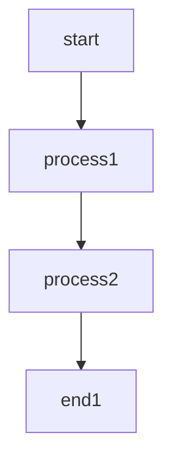
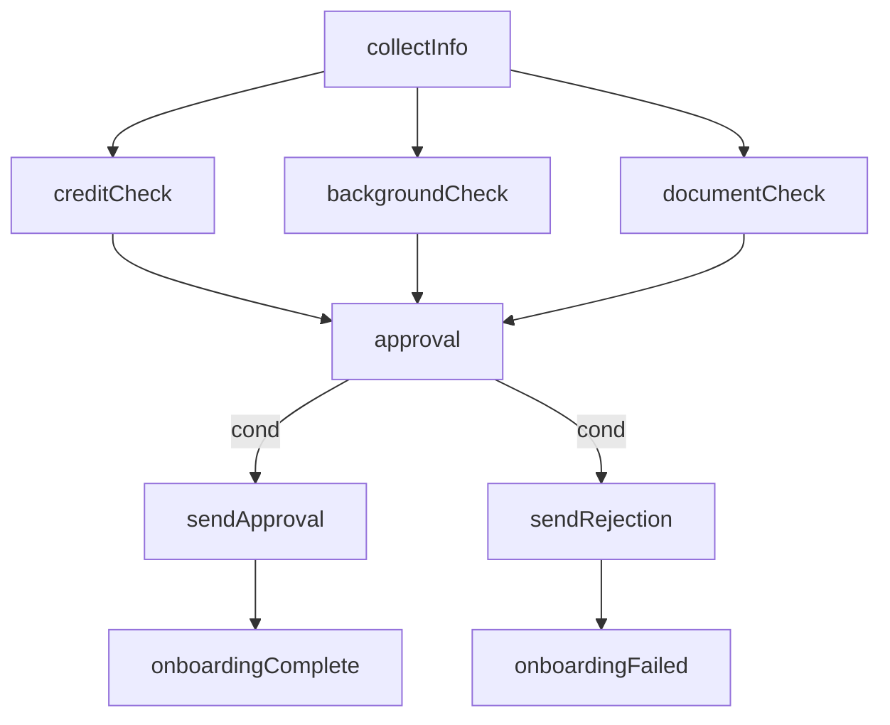
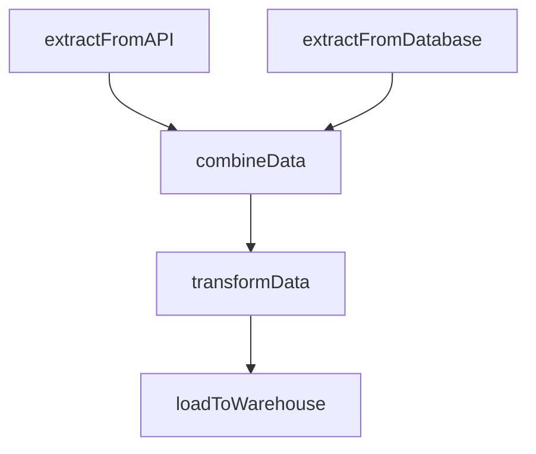
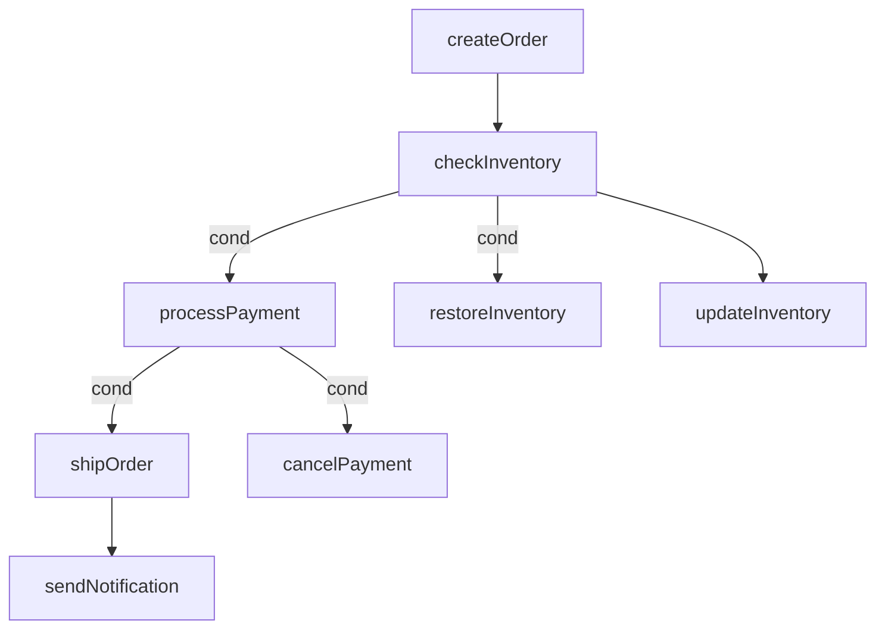

# Flow - 工作流编排库

🌍 **语言切换**：[English](README.md)

Flow 是一个功能强大的 Go 库，用于构建和执行工作流，提供两种执行模式：线性执行链（Chain）和图形化执行器（Graph）。

## 功能特性

- **线性工作流（Chain）**：以顺序方式执行任务，自动传递参数
- **图形化工作流（Graph）**：使用节点和边构建复杂工作流，支持不同类型的节点
- **多种节点类型**：支持开始、结束、分支、并行和循环节点
- **条件执行**：为边添加条件，实现基于运行时值的动态工作流路径
- **并行执行**：并发执行独立节点，提高性能
- **自动参数处理**：智能参数传递和节点间的类型转换
- **错误处理**：全面的错误传播和处理机制
- **可视化支持**：生成 Mermaid 和 Graphviz 图表用于工作流可视化
- **灵活的执行策略**：可选择顺序执行或并行执行

## 安装

```bash
go get github.com/zkep/flow
```

## 快速入门

### 基本 Chain 示例

```go
package main

import (
    "fmt"
    "github.com/zkep/flow"
)

func main() {
    chain := flow.NewChain()

    chain.Add("step1", func() int {
        return 10
    })

    chain.Add("step2", func(x int) int {
        return x * 2
    })

    chain.Add("step3", func(y int) int {
        return y + 5
    })

    err := chain.Run()
    if err != nil {
        fmt.Printf("错误: %v\n", err)
        return
    }

    result, err := chain.Value("step3")
    if err != nil {
        fmt.Printf("错误: %v\n", err)
        return
    }

    fmt.Printf("最终结果: %v\n", result) // 输出: 25
}
```

### 使用 `Use` 方法复用现有步骤

`Use` 方法允许您通过从现有链中选择特定步骤来创建新链。这在您想要重用先前执行的链中的某些步骤或创建步骤子集以进行进一步处理时特别有用。

#### 示例：创建步骤子集

```go
package main

import (
    "fmt"
    "github.com/zkep/flow"
)

func main() {
    // 创建并运行完整链
    originalChain := flow.NewChain()
    
    originalChain.Add("loadData", func() []int {
        return []int{1, 2, 3, 4, 5}
    })
    
    originalChain.Add("filterData", func(data []int) []int {
        var filtered []int
        for _, num := range data {
            if num > 2 {
                filtered = append(filtered, num)
            }
        }
        return filtered
    })
    
    originalChain.Add("processData", func(data []int) []int {
        var processed []int
        for _, num := range data {
            processed = append(processed, num*2)
        }
        return processed
    })
    
    originalChain.Add("saveData", func(data []int) error {
        fmt.Printf("保存数据: %v\n", data)
        return nil
    })
    
    fmt.Println("运行原始链:")
    err := originalChain.Run()
    if err != nil {
        fmt.Printf("错误: %v\n", err)
        return
    }
    
    // 创建仅使用特定步骤的新链
    // 这样我们可以重用数据加载和处理步骤
    fmt.Println("\n运行子集链:")
    subsetChain := originalChain.Use("loadData", "processData")
    
    err = subsetChain.Run()
    if err != nil {
        fmt.Printf("错误: %v\n", err)
        return
    }
    
    // 从子集链获取结果
    result, err := subsetChain.Value("processData")
    if err != nil {
        fmt.Printf("错误: %v\n", err)
        return
    }
    
    fmt.Printf("子集链结果: %v\n", result) // 输出: [2 4 6 8 10]
}
```

#### `Use` 方法的主要使用场景

1. **重用步骤**：从复杂链中提取特定步骤在不同上下文中重用
2. **部分处理**：创建只执行步骤子集的链进行集中处理
3. **步骤隔离**：独立测试单个步骤或步骤组
4. **动态工作流构建**：通过从现有链中选择步骤实时构建新工作流
5. **性能优化**：通过创建有针对性的链避免重新执行不必要的步骤

`Use` 方法会保持原始步骤名称和顺序，确保创建步骤子集时行为一致。

### 基本 Graph 示例

```go
package main

import (
    "fmt"
    "github.com/zkep/flow"
)

func main() {
    g := flow.NewGraph()

    g.StartNode("start", func() int {
        fmt.Println("执行开始节点")
        return 10
    })

    g.Node("process1", func(x int) int {
        fmt.Printf("执行 process1: %d * 2 = %d\n", x, x*2)
        return x * 2
    })

    g.Node("process2", func(x int) int {
        fmt.Printf("执行 process2: %d + 5 = %d\n", x, x+5)
        return x + 5
    })

    g.EndNode("end1", func(x int) {
        fmt.Printf("执行结束节点: 最终结果是 %d\n", x)
    })

    g.AddEdge("start", "process1")
    g.AddEdge("process1", "process2")
    g.AddEdge("process2", "end1")
    
    err := g.Run()
    if err != nil {
        fmt.Printf("错误: %v\n", err)
    } else {
        fmt.Println("执行成功完成")
    }
}
```
### Graph 数据可视化


## 使用说明

### Chain

Chain 模式允许您创建线性工作流，其中每个步骤按顺序执行，一个步骤的输出自动作为下一个步骤的输入。

#### 创建 Chain

```go
chain := flow.NewChain()
```

#### 添加步骤

```go
chain.Add("stepName", func() int {
    return 42
})
```

#### 运行 Chain

```go
err := chain.Run()
if err != nil {
    // 处理错误
}
```

#### 获取结果

```go
// 从步骤获取单个值
result, err := chain.Value("stepName")

// 从步骤获取所有值
results, err := chain.Values("stepName")
```

### Graph

Graph 模式允许您创建复杂的工作流，使用节点和边，支持不同类型的节点和执行策略。

#### 创建 Graph

```go
graph := flow.NewGraph()
```

#### 添加节点

```go
// 开始节点
graph.StartNode("start", func() int {
    return 42
})

// 普通节点
graph.Node("process", func(x int) int {
    return x * 2
})

// 结束节点
graph.EndNode("end", func(result int) {
    fmt.Println("结果:", result)
})

// 分支节点
graph.BranchNode("branch", func(x int) int {
    if x > 50 {
        return 1
    }
    return 0
})

// 并行节点
graph.ParallelNode("parallel", func(x int) int {
    return x + 10
})

// 循环节点
graph.LoopNode("loop", func(x int) int {
    return x - 1
})
```

#### 添加边

```go
// 简单边
graph.AddEdge("fromNode", "toNode")

// 带条件的边
graph.AddEdgeWithCondition("fromNode", "toNode", func(x int) bool {
    return x > 0
})
```

#### 运行 Graph

```go
// 顺序运行
err := graph.Run()

// 并行运行
err := graph.RunParallel()

// 带上下文的并行运行
ctx := context.Background()
err := graph.RunParallelWithContext(ctx)
```

#### 获取节点信息

```go
// 获取节点状态
status := graph.NodeStatus("nodeName")

// 获取节点结果
result := graph.NodeResult("nodeName")

// 获取节点错误
err := graph.NodeError("nodeName")
```

#### 可视化

```go
// 生成 Mermaid 图表
mermaid := graph.Mermaid()
fmt.Println(mermaid)

// 生成 Graphviz 图表
graphviz := graph.String()
fmt.Println(graphviz)
```

## 节点类型

| 节点类型 | 描述 |
|---------|------|
| Start | 工作流的起点 |
| End | 工作流的终点 |
| Normal | 标准处理节点 |
| Branch | 条件分支节点 |
| Parallel | 并行处理节点 |
| Loop | 循环操作节点 |

## 执行策略

- **顺序执行**：节点按照拓扑顺序逐个执行
- **并行执行**：并发执行独立节点，提高性能

## 高级特性

### 条件执行

使用 `AddEdgeWithCondition` 为边添加条件，实现基于运行时值的动态工作流路径。

### 并行执行

使用 `RunParallel()` 或 `RunParallelWithContext()` 并发执行独立节点，这可以显著提高具有许多独立任务的工作流的性能。

### 错误处理

Flow 自动通过工作流传播错误，当发生错误时停止执行。

### 参数处理

Flow 自动处理节点间的参数传递，包括可能的类型转换。

## 实际工作场景

### 1. 数据处理管道

**场景**：处理具有多个转换步骤的大型数据集

**实现**：
- 使用 `Chain` 进行顺序数据处理步骤
- 每个步骤转换数据并传递给下一个步骤
- 在每个步骤添加错误处理以捕获数据异常

**示例**：
```go
chain := flow.NewChain()

chain.Add("loadData", func() []string {
    // 从文件/数据库加载数据
    return []string{"data1", "data2", "data3"}
})

chain.Add("cleanData", func(data []string) []string {
    // 清洗和验证数据
    var cleaned []string
    for _, item := range data {
        if item != "" {
            cleaned = append(cleaned, strings.TrimSpace(item))
        }
    }
    return cleaned
})

chain.Add("transformData", func(data []string) []map[string]string {
    // 将数据转换为结构化格式
    var transformed []map[string]string
    for _, item := range data {
        transformed = append(transformed, map[string]string{"value": item})
    }
    return transformed
})

chain.Add("saveData", func(data []map[string]string) error {
    // 保存数据到数据库
    for _, item := range data {
        // 保存项目到数据库
        fmt.Printf("保存: %v\n", item)
    }
    return nil
})

if err := chain.Run(); err != nil {
    fmt.Printf("管道执行失败: %v\n", err)
}
```

### 2. 业务流程自动化

**场景**：自动化具有多个审批步骤的客户入职流程

**实现**：
- 使用 `Graph` 建模复杂的审批工作流
- 为批准/拒绝路径添加条件边
- 对独立验证步骤使用并行执行

**示例**：
```go
package main

import (
	"fmt"
	"strconv"
	"time"

	"github.com/zkep/flow"
)

func main() {
	graph := flow.NewGraph()
	collectInfo := map[string]string{
		"name":  "John Doe",
		"email": "john@example.com",
		"score": "85",
	}
	// 开始收集客户信息
	graph.StartNode("collectInfo", func() map[string]string {
		return collectInfo
	})

	// 信用检查
	graph.Node("creditCheck", func(info map[string]string) bool {
		score, _ := strconv.Atoi(info["score"])
		return score > 70
	})

	// 背景验证（并行）
	graph.ParallelNode("backgroundCheck", func(info map[string]string) bool {
		// 模拟背景检查
		time.Sleep(100 * time.Millisecond)
		return true
	})

	// 文档验证（并行）
	graph.ParallelNode("documentCheck", func(info map[string]string) bool {
		// 模拟文档验证
		time.Sleep(150 * time.Millisecond)
		return true
	})

	// 审批决策
	graph.BranchNode("approval", func(creditOk, backgroundOk, documentOk bool) string {
		if creditOk && backgroundOk && documentOk {
			return "approve"
		}
		return "reject"
	})

	// 批准路径
	graph.Node("sendApproval", func() {
		fmt.Printf("批准客户: %s\n", collectInfo["name"])
	})

	// 拒绝路径
	graph.Node("sendRejection", func() {
		fmt.Printf("拒绝客户: %s\n", collectInfo["name"])
	})

	// 结束节点
	graph.EndNode("onboardingComplete", func() {
		fmt.Println("客户入职成功完成")
	})

	graph.EndNode("onboardingFailed", func() {
		fmt.Println("客户入职失败")
	})

	// 添加边
	graph.AddEdge("collectInfo", "creditCheck")
	graph.AddEdge("collectInfo", "backgroundCheck")
	graph.AddEdge("collectInfo", "documentCheck")
	graph.AddEdge("creditCheck", "approval")
	graph.AddEdge("backgroundCheck", "approval")
	graph.AddEdge("documentCheck", "approval")
	graph.AddEdgeWithCondition("approval", "sendApproval", func(decision string) bool {
		return decision == "approve"
	})
	graph.AddEdgeWithCondition("approval", "sendRejection", func(decision string) bool {
		return decision == "reject"
	})
	graph.AddEdge("sendApproval", "onboardingComplete")
	graph.AddEdge("sendRejection", "onboardingFailed")
	fmt.Println(graph.Mermaid())
	// 并行运行以提高速度
	if err := graph.RunParallel(); err != nil {
		fmt.Printf("入职流程失败: %v\n", err)
	}
}
```

### 3. 客户入职流程可视化



### 3. ETL（提取、转换、加载）工作流

**场景**：从多个源提取数据，转换后加载到数据仓库

**实现**：
- 使用 `Graph` 并行执行数据提取
- 使用 `Chain` 进行顺序转换步骤
- 添加数据质量问题的错误处理

**示例**：
```go
package main

import (
	"fmt"

	"github.com/zkep/flow"
)

func main() {
	graph := flow.NewGraph()

	// 并行从多个源提取数据
	graph.ParallelNode("extractFromAPI", func() []map[string]interface{} {
		// 从 API 提取数据
		return []map[string]interface{}{
			{"id": 1, "name": "Product A", "price": 100},
			{"id": 2, "name": "Product B", "price": 200},
		}
	})

	graph.ParallelNode("extractFromDatabase", func() []map[string]interface{} {
		// 从数据库提取数据
		return []map[string]interface{}{
			{"id": 3, "name": "Product C", "price": 150},
			{"id": 4, "name": "Product D", "price": 250},
		}
	})

	// 合并提取的数据
	graph.Node("combineData", func(apiData, dbData []map[string]interface{}) []map[string]interface{} {
		combined := append(apiData, dbData...)
		return combined
	})

	// 转换数据
	graph.Node("transformData", func(data []map[string]interface{}) []map[string]interface{} {
		var transformed []map[string]interface{}
		for _, item := range data {
			price := item["price"].(int)
			item["priceWithTax"] = int(float64(price) * 1.2) // 添加 20% 税
			item["category"] = "General"
			transformed = append(transformed, item)
		}
		return transformed
	})

	// 加载数据
	graph.EndNode("loadToWarehouse", func(data []map[string]interface{}) error {
		fmt.Printf("将 %d 个项目加载到数据仓库\n", len(data))
		// 加载数据到仓库
		for _, item := range data {
			fmt.Printf("加载: %v\n", item)
		}
		return nil
	})

	// 添加边
	graph.AddEdge("extractFromAPI", "combineData")
	graph.AddEdge("extractFromDatabase", "combineData")
	graph.AddEdge("combineData", "transformData")
	graph.AddEdge("transformData", "loadToWarehouse")

	fmt.Println(graph.Mermaid())
	// 并行运行
	if err := graph.RunParallel(); err != nil {
		fmt.Printf("ETL 流程失败: %v\n", err)
	}
}

```

ETL 工作流可视化


### 4. 微服务编排

**场景**：协调多个微服务完成业务交易

**实现**：
- 使用 `Graph` 建模微服务交互
- 添加用于错误处理的补偿节点
- 对独立服务使用并行执行

**示例**：
```go
package main

import (
	"fmt"

	"github.com/zkep/flow"
)

func main() {
	graph := flow.NewGraph()

	// 开始订单信息
	graph.StartNode("createOrder", func() map[string]interface{} {
		return map[string]interface{}{
			"orderId":    "ORD-123",
			"customerId": "CUST-456",
			"items":      []string{"ITEM-1", "ITEM-2"},
			"total":      300,
		}
	})

	// 检查库存
	graph.Node("checkInventory", func(order map[string]interface{}) bool {
		// 库存检查服务
		fmt.Println("检查库存...")
		return true // 库存可用
	})

	// 处理支付
	graph.Node("processPayment", func(available bool) bool {
		// 支付服务
		fmt.Println("处理支付...")
		return true // 支付成功
	})

	// 更新库存（与支付并行）
	graph.ParallelNode("updateInventory", func(available bool) bool {
		// 库存服务
		fmt.Println("更新库存...")
		return true
	})

	// 发货
	graph.Node("shipOrder", func(success bool) string {
		// 物流服务
		fmt.Println("发货...")
		return "SHIP-789"
	})

	// 发送通知
	graph.EndNode("sendNotification", func(trackingId string) {
		// 通知服务
		fmt.Printf("发货完成，追踪号 %s\n", trackingId)
	})

	// 失败补偿节点
	graph.Node("cancelPayment", func(success bool) {
		fmt.Println("取消支付")
	})

	graph.Node("restoreInventory", func(available bool) {
		fmt.Println("恢复库存")
	})

	// 添加边
	graph.AddEdge("createOrder", "checkInventory")
	graph.AddEdgeWithCondition("checkInventory", "processPayment", func(available bool) bool {
		return available
	})
	graph.AddEdgeWithCondition("checkInventory", "restoreInventory", func(available bool) bool {
		return !available
	})
	graph.AddEdge("checkInventory", "updateInventory")
	graph.AddEdgeWithCondition("processPayment", "shipOrder", func(success bool) bool {
		return success
	})
	graph.AddEdgeWithCondition("processPayment", "cancelPayment", func(success bool) bool {
		return !success
	})
	graph.AddEdge("shipOrder", "sendNotification")
	fmt.Println(graph.Mermaid())
	// 为独立服务并行运行
	if err := graph.RunParallel(); err != nil {
		fmt.Printf("订单处理失败: %v\n", err)
	}
}
```
数据可视化


## 示例

库在 `_examples` 目录中包含多个示例：

- **基础示例**：
  - [`basic-chain`](https://github.com/zkep/flow/tree/master/_examples/basic-chain)：基础链式工作流
  - [`basic-graph`](https://github.com/zkep/flow/tree/master/_examples/basic-graph)：基础图形工作流

- **高级示例**：
  - [`advanced-chain`](https://github.com/zkep/flow/tree/master/_examples/advanced-chain)：具有复杂参数传递的高级链式工作流
  - [`advanced-graph`](https://github.com/zkep/flow/tree/master/_examples/advanced-graph)：具有多种节点类型的高级图形工作流
  - [`combined-flow`](https://github.com/zkep/flow/tree/master/_examples/combined-flow)：组合链式和图形工作流
  - [`advanced-processing`](https://github.com/zkep/flow/tree/master/_examples/advanced-processing)：高级处理模式

## 贡献

欢迎贡献！请随时提交 Pull Request。

## 许可证

Flow 使用 MIT 许可证。详情请参阅 [LICENSE](LICENSE) 文件。