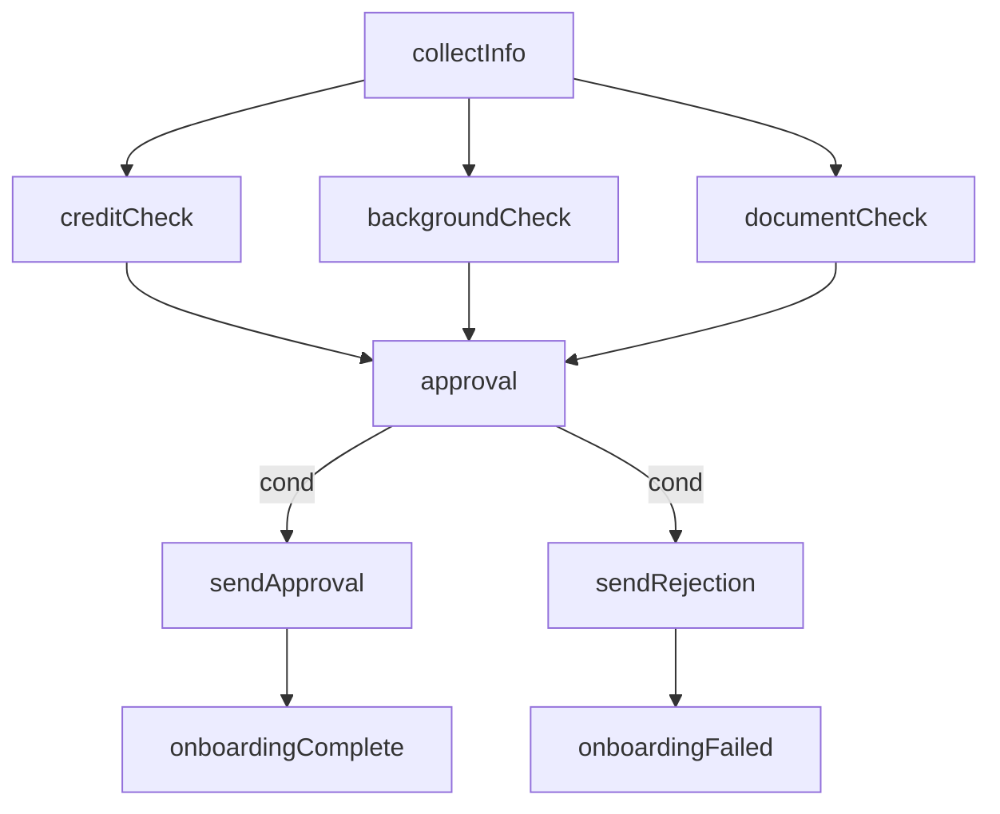
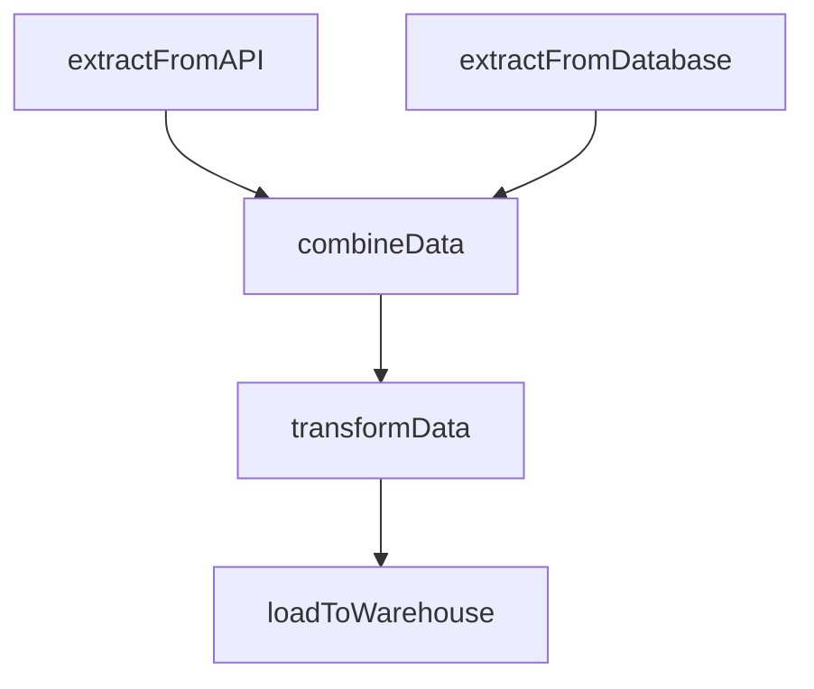
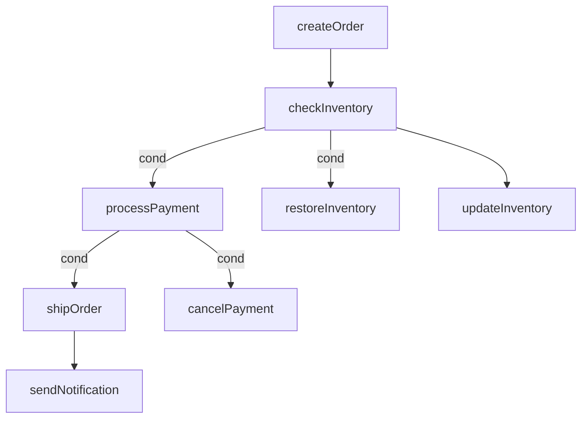

# Flow - Workflow Orchestration Library

🌍 **Language Switch**: [中文文档](README-zh.md)

Flow is a powerful Go library for building and executing workflows, providing two execution modes: linear execution chain (Chain) and graphical executor (Graph).

## Features

- **Linear Workflows (Chain)**: Execute tasks in a sequential manner with automatic parameter passing
- **Graphical Workflows (Graph)**: Build complex workflows with nodes and edges, supporting different node types
- **Multiple Node Types**: Support for start, end, branch, parallel, and loop nodes
- **Conditional Execution**: Add conditions to edges for controlled workflow paths
- **Parallel Execution**: Execute independent nodes concurrently for improved performance
- **Automatic Parameter Handling**: Smart parameter passing and type conversion between tasks
- **Error Handling**: Comprehensive error propagation and handling
- **Visualization Support**: Generate Mermaid and Graphviz diagrams for workflow visualization
- **Flexible Execution Strategies**: Choose between sequential and parallel execution

## Installation

```bash
go get github.com/zkep/flow
```

## Quick Start

### Basic Chain Example

```go
package main

import (
    "fmt"
    "github.com/zkep/flow"
)

func main() {
    chain := flow.NewChain()

    chain.Add("step1", func() int {
        return 10
    })

    chain.Add("step2", func(x int) int {
        return x * 2
    })

    chain.Add("step3", func(y int) int {
        return y + 5
    })

    err := chain.Run()
    if err != nil {
        fmt.Printf("Error: %v\n", err)
        return
    }

    result, err := chain.Value("step3")
    if err != nil {
        fmt.Printf("Error: %v\n", err)
        return
    }

    fmt.Printf("Final Result: %v\n", result) // Output: 25
}
```

### Using Existing Steps with `Use`

The `Use` method allows you to create a new chain by selecting specific steps from an existing chain. This is particularly useful when you want to reuse certain steps from a previously executed chain or create a subset of steps for further processing.

#### Example: Creating a Subset of Steps

```go
package main

import (
    "fmt"
    "github.com/zkep/flow"
)

func main() {
    // Create and run a full chain
    originalChain := flow.NewChain()
    
    originalChain.Add("loadData", func() []int {
        return []int{1, 2, 3, 4, 5}
    })
    
    originalChain.Add("filterData", func(data []int) []int {
        var filtered []int
        for _, num := range data {
            if num > 2 {
                filtered = append(filtered, num)
            }
        }
        return filtered
    })
    
    originalChain.Add("processData", func(data []int) []int {
        var processed []int
        for _, num := range data {
            processed = append(processed, num*2)
        }
        return processed
    })
    
    originalChain.Add("saveData", func(data []int) error {
        fmt.Printf("Saving data: %v\n", data)
        return nil
    })
    
    fmt.Println("Running original chain:")
    err := originalChain.Run()
    if err != nil {
        fmt.Printf("Error: %v\n", err)
        return
    }
    
    // Create a new chain using only specific steps
    // This allows us to reuse the data loading and processing steps
    fmt.Println("\nRunning subset chain:")
    subsetChain := originalChain.Use("loadData", "processData")
    
    err = subsetChain.Run()
    if err != nil {
        fmt.Printf("Error: %v\n", err)
        return
    }
    
    // Get results from the subset chain
    result, err := subsetChain.Value("processData")
    if err != nil {
        fmt.Printf("Error: %v\n", err)
        return
    }
    
    fmt.Printf("Subset chain result: %v\n", result) // Output: [2 4 6 8 10]
}
```

#### Key Use Cases for `Use`

1. **Reusing Steps**: Extract specific steps from a complex chain to reuse them in different contexts
2. **Partial Processing**: Create a chain that only executes a subset of steps for focused processing
3. **Step Isolation**: Test individual steps or groups of steps independently
4. **Dynamic Workflow Construction**: Build new workflows on-the-fly by selecting steps from existing chains
5. **Performance Optimization**: Avoid re-executing unnecessary steps by creating targeted chains

The `Use` method maintains the original step names and their order, ensuring consistent behavior when creating subsets of steps.

### Basic Graph Example

```go
package main

import (
    "fmt"
    "github.com/zkep/flow"
)

func main() {
    g := flow.NewGraph()

    g.StartNode("start", func() int {
        fmt.Println("Executing start node")
        return 10
    })

    g.Node("process1", func(x int) int {
        fmt.Printf("Executing process1: %d * 2 = %d\n", x, x*2)
        return x * 2
    })

    g.Node("process2", func(x int) int {
        fmt.Printf("Executing process2: %d + 5 = %d\n", x, x+5)
        return x + 5
    })

    g.EndNode("end", func(x int) {
        fmt.Printf("Executing end node: Final result is %d\n", x)
    })

    g.AddEdge("start", "process1")
    g.AddEdge("process1", "process2")
    g.AddEdge("process2", "end")

    err := g.Run()
    if err != nil {
        fmt.Printf("Error: %v\n", err)
    } else {
        fmt.Println("Execution completed successfully")
    }
}
```

### Graph Visualization

```mermaid
graph TD
    start --> process1
    process1 --> process2
    process2 --> end
```

## Usage

### Chain

The Chain mode allows you to create linear workflows where each step executes in sequence, with the output of one step automatically passed as input to the next.

#### Creating a Chain

```go
chain := flow.NewChain()
```

#### Adding Steps

```go
chain.Add("stepName", func() int {
    return 42
})
```

#### Running the Chain

```go
err := chain.Run()
if err != nil {
    // Handle error
}
```

#### Retrieving Results

```go
// Get a single value from a step
result, err := chain.Value("stepName")

// Get all values from a step
results, err := chain.Values("stepName")
```

### Graph

The Graph mode allows you to create complex workflows with nodes and edges, supporting different node types and execution strategies.

#### Creating a Graph

```go
graph := flow.NewGraph()
```

#### Adding Nodes

```go
// Start node
graph.StartNode("start", func() int {
    return 42
})

// Normal node
graph.Node("process", func(x int) int {
    return x * 2
})

// End node
graph.EndNode("end", func(result int) {
    fmt.Println("Result:", result)
})

// Branch node
graph.BranchNode("branch", func(x int) int {
    if x > 50 {
        return 1
    }
    return 0
})

// Parallel node
graph.ParallelNode("parallel", func(x int) int {
    return x + 10
})

// Loop node
graph.LoopNode("loop", func(x int) int {
    return x - 1
})
```

#### Adding Edges

```go
// Simple edge
graph.AddEdge("fromNode", "toNode")

// Edge with condition
graph.AddEdgeWithCondition("fromNode", "toNode", func(x int) bool {
    return x > 0
})
```

#### Running the Graph

```go
// Run sequentially
err := graph.Run()

// Run in parallel
err := graph.RunParallel()

// Run in parallel with context
ctx := context.Background()
err := graph.RunParallelWithContext(ctx)
```

#### Retrieving Node Information

```go
// Get node status
status := graph.NodeStatus("nodeName")

// Get node result
result := graph.NodeResult("nodeName")

// Get node error
err := graph.NodeError("nodeName")
```

#### Visualization

```go
// Generate Mermaid diagram
mermaid := graph.Mermaid()
fmt.Println(mermaid)

// Generate Graphviz diagram
graphviz := graph.String()
fmt.Println(graphviz)
```

## Node Types

| Node Type | Description |
|-----------|-------------|
| Start | The starting point of a workflow |
| End | The ending point of a workflow |
| Normal | Standard processing node |
| Branch | Node for conditional branching |
| Parallel | Node for parallel processing |
| Loop | Node for loop operations |

## Execution Strategies

- **Sequential Execution**: Nodes are executed one after another in topological order
- **Parallel Execution**: Independent nodes are executed concurrently for improved performance

## Advanced Features

### Conditional Execution

Use `AddEdgeWithCondition` to add conditions to edges, allowing for dynamic workflow paths based on runtime values.

### Parallel Execution

Use `RunParallel()` or `RunParallelWithContext()` to execute independent nodes concurrently, which can significantly improve performance for workflows with many independent tasks.

### Error Handling

Flow automatically propagates errors through the workflow, stopping execution when an error occurs.

### Parameter Handling

Flow automatically handles parameter passing between nodes, including type conversion when possible.

## Real-World Use Cases

### 1. Data Processing Pipeline

**Scenario**: Processing large datasets with multiple transformation steps

**Implementation**: 
- Use `Chain` for sequential data processing steps
- Each step transforms the data and passes it to the next
- Add error handling at each step to catch data anomalies

**Example**: 
```go
chain := flow.NewChain()

chain.Add("loadData", func() []string {
    // Load data from file/database
    return []string{"data1", "data2", "data3"}
})

chain.Add("cleanData", func(data []string) []string {
    // Clean and validate data
    var cleaned []string
    for _, item := range data {
        if item != "" {
            cleaned = append(cleaned, strings.TrimSpace(item))
        }
    }
    return cleaned
})

chain.Add("transformData", func(data []string) []map[string]string {
    // Transform data into structured format
    var transformed []map[string]string
    for _, item := range data {
        transformed = append(transformed, map[string]string{"value": item})
    }
    return transformed
})

chain.Add("saveData", func(data []map[string]string) error {
    // Save data to database
    for _, item := range data {
        // Save item to database
        fmt.Printf("Saving: %v\n", item)
    }
    return nil
})

if err := chain.Run(); err != nil {
    fmt.Printf("Pipeline failed: %v\n", err)
}
```

### 2. Business Process Automation

**Scenario**: Automating a customer onboarding process with multiple approval steps

**Implementation**: 
- Use `Graph` to model complex approval workflows
- Add conditional edges for approval/rejection paths
- Use parallel execution for independent verification steps

**Example**: 
```go
graph := flow.NewGraph()

// Start with customer information
graph.StartNode("collectInfo", func() map[string]string {
    return map[string]string{
        "name": "John Doe",
        "email": "john@example.com",
        "score": "85",
    }
})

// Credit check
graph.Node("creditCheck", func(info map[string]string) bool {
    score, _ := strconv.Atoi(info["score"])
    return score > 70
})

// Background verification (parallel)
graph.ParallelNode("backgroundCheck", func(info map[string]string) bool {
    // Simulate background check
    time.Sleep(100 * time.Millisecond)
    return true
})

// Document verification (parallel)
graph.ParallelNode("documentCheck", func(info map[string]string) bool {
    // Simulate document verification
    time.Sleep(150 * time.Millisecond)
    return true
})

// Approval decision
graph.BranchNode("approval", func(creditOk, backgroundOk, documentOk bool) string {
    if creditOk && backgroundOk && documentOk {
        return "approve"
    }
    return "reject"
})

// Approve path
graph.Node("sendApproval", func(info map[string]string) {
    fmt.Printf("Approving customer: %s\n", info["name"])
})

// Reject path
graph.Node("sendRejection", func(info map[string]string) {
    fmt.Printf("Rejecting customer: %s\n", info["name"])
})

// End nodes
graph.EndNode("onboardingComplete", func() {
    fmt.Println("Customer onboarding completed successfully")
})

graph.EndNode("onboardingFailed", func() {
    fmt.Println("Customer onboarding failed")
})

// Add edges
graph.AddEdge("collectInfo", "creditCheck")
graph.AddEdge("collectInfo", "backgroundCheck")
graph.AddEdge("collectInfo", "documentCheck")
graph.AddEdge("creditCheck", "approval")
graph.AddEdge("backgroundCheck", "approval")
graph.AddEdge("documentCheck", "approval")
graph.AddEdgeWithCondition("approval", "sendApproval", func(decision string) bool {
    return decision == "approve"
})
graph.AddEdgeWithCondition("approval", "sendRejection", func(decision string) bool {
    return decision == "reject"
})
graph.AddEdge("sendApproval", "onboardingComplete")
graph.AddEdge("sendRejection", "onboardingFailed")

// Run in parallel for faster execution
if err := graph.RunParallel(); err != nil {
    fmt.Printf("Onboarding process failed: %v\n", err)
}
```

### Customer Onboarding Visualization



### 3. ETL (Extract, Transform, Load) Workflow

**Scenario**: Extracting data from multiple sources, transforming it, and loading it into a data warehouse

**Implementation**: 
- Use `Graph` with parallel execution for data extraction
- Use `Chain` for sequential transformation steps
- Add error handling for data quality issues

**Example**: 
```go
graph := flow.NewGraph()

// Extract data from multiple sources in parallel
graph.ParallelNode("extractFromAPI", func() []map[string]interface{} {
    // Extract data from API
    return []map[string]interface{}{
        {"id": 1, "name": "Product A", "price": 100},
        {"id": 2, "name": "Product B", "price": 200},
    }
})

graph.ParallelNode("extractFromDatabase", func() []map[string]interface{} {
    // Extract data from database
    return []map[string]interface{}{
        {"id": 3, "name": "Product C", "price": 150},
        {"id": 4, "name": "Product D", "price": 250},
    }
})

// Combine extracted data
graph.Node("combineData", func(apiData, dbData []map[string]interface{}) []map[string]interface{} {
    combined := append(apiData, dbData...)
    return combined
})

// Transform data
graph.Node("transformData", func(data []map[string]interface{}) []map[string]interface{} {
    var transformed []map[string]interface{}
    for _, item := range data {
        price := item["price"].(int)
        item["priceWithTax"] = price * 1.2 // Add 20% tax
        item["category"] = "General"
        transformed = append(transformed, item)
    }
    return transformed
})

// Load data
graph.EndNode("loadToWarehouse", func(data []map[string]interface{}) error {
    fmt.Printf("Loading %d items to data warehouse\n", len(data))
    // Load data to warehouse
    for _, item := range data {
        fmt.Printf("Loading: %v\n", item)
    }
    return nil
})

// Add edges
graph.AddEdge("extractFromAPI", "combineData")
graph.AddEdge("extractFromDatabase", "combineData")
graph.AddEdge("combineData", "transformData")
graph.AddEdge("transformData", "loadToWarehouse")

// Run in parallel
if err := graph.RunParallel(); err != nil {
    fmt.Printf("ETL process failed: %v\n", err)
}
```

### ETL Workflow Visualization



### 4. Microservice Orchestration

**Scenario**: Coordinating multiple microservices to complete a business transaction

**Implementation**: 
- Use `Graph` to model microservice interactions
- Add compensation nodes for error handling
- Use parallel execution for independent services

**Example**: 
```go
graph := flow.NewGraph()

// Start with order information
graph.StartNode("createOrder", func() map[string]interface{} {
    return map[string]interface{}{
        "orderId": "ORD-123",
        "customerId": "CUST-456",
        "items": []string{"ITEM-1", "ITEM-2"},
        "total": 300,
    }
})

// Check inventory
graph.Node("checkInventory", func(order map[string]interface{}) bool {
    // Check inventory service
    fmt.Println("Checking inventory...")
    return true // Inventory available
})

// Process payment
graph.Node("processPayment", func(order map[string]interface{}) bool {
    // Payment service
    fmt.Println("Processing payment...")
    return true // Payment successful
})

// Update inventory (parallel with payment)
graph.ParallelNode("updateInventory", func(order map[string]interface{}) bool {
    // Inventory service
    fmt.Println("Updating inventory...")
    return true
})

// Ship order
graph.Node("shipOrder", func(order map[string]interface{}) string {
    // Shipping service
    fmt.Println("Shipping order...")
    return "SHIP-789"
})

// Send notification
graph.EndNode("sendNotification", func(order map[string]interface{}, trackingId string) {
    // Notification service
    fmt.Printf("Sending notification for order %s with tracking %s\n", order["orderId"], trackingId)
})

// Compensation nodes for failures
graph.Node("cancelPayment", func(order map[string]interface{}) {
    fmt.Printf("Cancelling payment for order %s\n", order["orderId"])
})

graph.Node("restoreInventory", func(order map[string]interface{}) {
    fmt.Printf("Restoring inventory for order %s\n", order["orderId"])
})

// Add edges
graph.AddEdge("createOrder", "checkInventory")
graph.AddEdgeWithCondition("checkInventory", "processPayment", func(available bool) bool {
    return available
})
graph.AddEdgeWithCondition("checkInventory", "restoreInventory", func(available bool) bool {
    return !available
})
graph.AddEdge("checkInventory", "updateInventory")
graph.AddEdgeWithCondition("processPayment", "shipOrder", func(success bool) bool {
    return success
})
graph.AddEdgeWithCondition("processPayment", "cancelPayment", func(success bool) bool {
    return !success
})
graph.AddEdge("shipOrder", "sendNotification")

// Run with parallel execution for independent services
if err := graph.RunParallel(); err != nil {
    fmt.Printf("Order processing failed: %v\n", err)
}
```

### Microservice Orchestration Visualization



## Examples

The library includes several examples in the `_examples` directory:

- **Basic Examples**:
  - [`basic-chain`](https://github.com/zkep/flow/tree/master/_examples/basic-chain): Basic chain workflow
  - [`basic-graph`](https://github.com/zkep/flow/tree/master/_examples/basic-graph): Basic graph workflow

- **Advanced Examples**:
  - [`advanced-chain`](https://github.com/zkep/flow/tree/master/_examples/advanced-chain): Advanced chain with complex parameter passing
  - [`advanced-graph`](https://github.com/zkep/flow/tree/master/_examples/advanced-graph): Advanced graph with multiple node types
  - [`combined-flow`](https://github.com/zkep/flow/tree/master/_examples/combined-flow): Combining chain and graph workflows
  - [`advanced-processing`](https://github.com/zkep/flow/tree/master/_examples/advanced-processing): Advanced processing patterns

## Contributing

Contributions are welcome! Please feel free to submit a Pull Request.

## License

Flow is licensed under the MIT License. See the [LICENSE](LICENSE) file for details.
